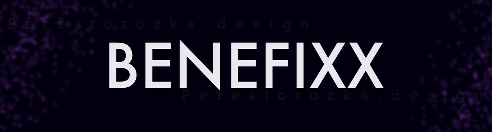

```
Backend Developer
```
***


## My Achievements
- [Грамота от Мэрии Грозного](assets/meriya.jpg)
- [Грамота от Депортамента Грозного](assets/deportamentjpg.jpg)
#
- 1 место - [Всероссийский открытый конкурс юношеских исследовательских работ имени Вернадского](assets/vernadsky.png)
- 1 место -  [Международный конкурс компьютерного творчества "Мастер информационных технологий](assets/masterit.jpg)
- 1 место [Республиканский конкурс "Знания в жизнь" информационные технологии (жду диплом)](assets/znanija_v_jizn.png)
#
- 2 место Сертификат от ГГНТУ и приз ( 6666 рублей ) [Научно-Техническое творчество молодежи Чеченской Республики - 2021](assets/ggntu.png)
- 2 место [IT-информационные технологии в Республиканском конкурсе инженерных команд "INGENIUM 2021"](assets/ingenium.png)
#
[Полный список наград за 2021+](https://github.com/benefixx/achievements)
***


### Languages and Tools:


***

## Contacts:
[](https://t.me/benefixx)
[](https://www.instagram.com/aliev.rkh)
[](https://vk.com/yfnet)
***
## Progress


